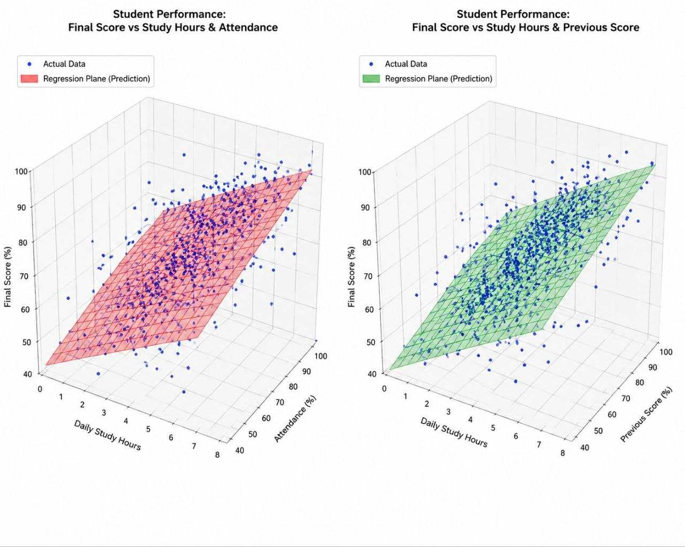
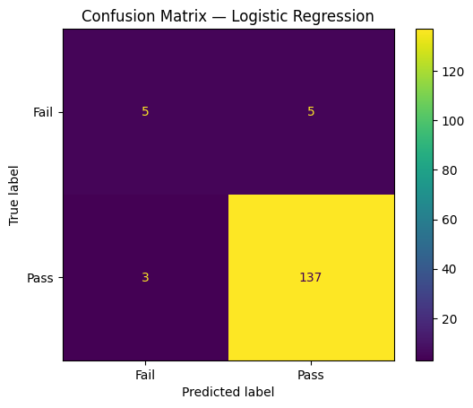
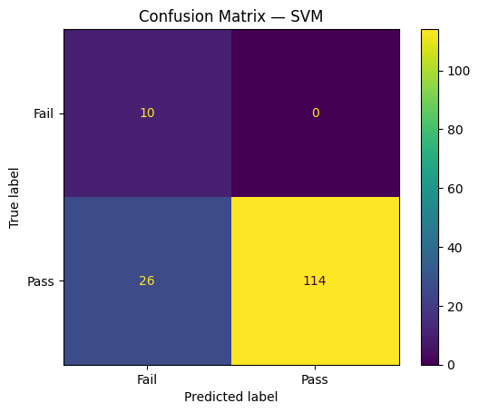

# Student Performance Prediction: Pass / Fail

## Dataset
This dataset was taken from this website https://huggingface.co/datasets/jason1966/algozee_student/blob/main/student_performance_interactions.csv?utm_source=chatgpt.com.
Dataset содержит более 1000 строк и 18 признаков, из которых 9 были отобраны для построения модели.
The data was selected based on the most significant features that may affect students' final test results.
Dataset имеет относительно небольшую популярность, что снижает вероятность его широкого использования в аналогичных проектах.

## Research Question:

> Does lifestyle information help improve the prediction of academic performance?


## Project

The main goal of the project is to predict whether a student will pass the test based on the 9 features I selected.

- `0 = Fail`
- `1 = Pass`

The main feature of the task is a strong class imbalance. Therefore, high overall `Accuracy` is not considered sufficient evidence of good model performance.

---
### Feature selection experiment

Two sets of features are compared:

#### Academic features only

- previous scores
- study hours
- attendance
- homework completion

#### Academic + lifestyle

Additionally:

- sleep hours
- screen time
- 
#### Unselected features
We did not use other features, such as anxiety, because they are difficult to explain objectively in real life.
---

## Selected Features

| № | Feature | Category | Description | Impact on result |
|---|---|---|---|---|
| 1 | previous_score | Academic | Previous student score, showing their overall academic performance. | 🟢 Positive |
| 2 | math_prev_score | Academic | Previous mathematics score, reflecting the student's level of mathematical knowledge. | 🟢 Positive |
| 3 | science_prev_score | Academic | Previous science score. | 🟢 Positive |
| 4 | language_prev_score | Academic | Previous language-subject score. | 🟢 Positive |
| 5 | daily_study_hours | Academic | Average number of study hours per day. | 🟢 Positive |
| 6 | attendance_percentage | Academic | Class attendance percentage. | 🟢 Positive |
| 7 | homework_completion_rate | Academic | Percentage of completed homework assignments. | 🟢 Positive |
| 8 | sleep_hours | Lifestyle | Average number of hours of sleep per day. | 🟢 Positive |
| 9 | screen_time_hours | Lifestyle | Average number of hours spent on screens. | 🔴 Negative |

---

## Project Structure

```text
student-pass-fail-ml-github/
│
├── student_pass_fail_analysis_ru.ipynb
├── README.md
└── requirements.txt
```

---

## Implemented

### 1. Baseline

A simple baseline model was added:

```text
Always predict Pass
```

It demonstrates an important problem of imbalanced classification: high Accuracy can be achieved while not detecting a single student from the `Fail` class.

---

### 2. Metrics

The following metrics are used to evaluate the models:

- Accuracy  
- Balanced Accuracy  
- Macro-F1   
- Fail Precision 
- Fail Recall
- Fail F1

  ### Metrics

Accuracy:

$$
Accuracy = \frac{TP + TN}{TP + TN + FP + FN}
$$

Balanced Accuracy:

$$
Balanced\ Accuracy = \frac{Recall_{class1} + Recall_{class2}}{2}
$$

Recall: 

$$
Recall = \frac{TP}{TP + FN}
$$

Macro-F1:

$$
Macro\text{-}F1 = \frac{F1_1 + F1_2 + ... + F1_n}{n}
$$

Fail Precision:

$$
Precision_{fail} = \frac{TP_{fail}}{TP_{fail} + FP_{fail}}
$$

Fail Recall:

$$
Recall_{fail} = \frac{TP_{fail}}{TP_{fail} + FN_{fail}}
$$

Fail F1:

$$
F1_{fail} = 2 \cdot \frac{Precision_{fail} \cdot Recall_{fail}}
{Precision_{fail} + Recall_{fail}}
$$

Special attention is paid to the `Fail` class because it is the most difficult to detect due to the small number of examples.

### Probability threshold experiment

`predict_proba()` is used for Logistic Regression. `predict_proba()`.

The probability threshold is selected on Validation and then evaluated on Test.

This makes it possible to investigate the trade-off between:

- high `Fail Recall`;
- high `Fail Precision`.

---

### 3. Data Splitting

A single sequential pipeline is used:

```text
Train / Validation / Test
≈ 70% / 15% / 15%
```

- Train — model training.
- Validation — hyperparameter selection.
- Test — final evaluation only.

The split is performed using `stratify` to preserve the class ratio.

---

### 4. Scaling

`StandardScaler` is fitted only on Train:

```python
scaler.fit(X_train)
```

$$
X_{scaled} = \frac{X - \mu}{\sigma}
$$

where:
- $X$ — original value
- $\mu$ — feature mean
- $\sigma$ — standard deviation
- $X_{scaled}$ — scaled value

It is then applied to Validation and Test.

This prevents data leakage (the leakage of information from test data into model training).

---

### 5. Logistic Regression

The following are investigated for Logistic Regression:

```text
C = 0.01, 0.1, 1, 10
C is a parameter that determines the strength of regularization.
The smaller C is, the stronger the regularization; the larger C is, the weaker the regularization.
```

$$
C = \frac{1}{\lambda}
$$

и:

```text
class_weight = None / balanced
class weight is a parameter that determines how strongly the model should account for each class.
```
$$
w_i = \frac{n}{k \cdot n_i}
$$

Parameter selection is performed using Validation.

---


### 6. Linear SVM

$$
\min_{w,b} \frac{1}{2}\|w\|^2 + C\sum_{i=1}^{n}\max(0,\,1-y_i(w^Tx_i+b))
$$

The following is used for SVM:

```python
kernel="linear"
```
```
I chose Soft Margin SVM because the dataset contains noise and the graph is not evenly distributed.
z
```

## SVM Hyperplane

$$
w^T x + b = 0
$$



            


The graph shows the distribution of students from the dataset and the separating hyperplane of the linear SVM model.


This corresponds to a linear soft-margin SVM.

Different values are also investigated:

```text
C = 0.01, 0.1, 1, 10
```

and different class-balancing options.

---

### 7. Error Analysis

Instead of limiting the analysis to TN, FP, FN, and TP, errors in the project are described directly:

- Actual Fail → Predicted Fail (True Negative)
- Actual Fail → Predicted Pass (False Positive)
- Actual Pass → Predicted Fail (False Negative)
- Actual Pass → Predicted Pass (True Positive)

The most dangerous error:

```text
Фактически Fail → Предсказано Pass
```

This means that the model missed a student from the risk group.

---

## 8. Confusion Matrix

### Logistic Regression

The Confusion Matrix shows the model's correct and incorrect predictions for the two classes: Fail and Pass.

- Diagonal — correct predictions.
- Off-diagonal — model errors.

The more correct predictions and the fewer errors, the better the model.




### SVM

The Confusion Matrix shows how well SVM determines whether a student will pass (Pass) or fail (Fail) the test.

As with Logistic Regression, the diagonal shows correct predictions, while values outside the diagonal represent errors.



---

### Comparison

The best model is the one with more correct predictions and fewer errors.

---

### 9. Checking Agreement Between Model Predictions

A separate check was added to the project:

```python
pred_logistic == pred_svm
```

If Logistic Regression and Linear SVM produce the same results for all Test objects, this is displayed separately and interpreted.

---

## Main Project Conclusion

For an imbalanced task, high Accuracy does not guarantee a good model.

The baseline may show high Accuracy while not detecting any student from the `Fail` class.

A model with class balancing may have lower Accuracy but significantly better `Fail Recall`.

Например, ситуация:

```text
Высокий Fail Recall
+
Низкий Fail Precision
```

means:

- the model is good at finding students in the risk group;
- but at the same time creates many false alarms.

Therefore, the final evaluation should consider the trade-off between Precision and Recall.

---

## Project Limitations

The dataset contains relatively few students from the `Fail` class.

After the Train / Validation / Test split, approximately 10–11 objects from the `Fail` class remain in Validation and Test.

Because of this, hyperparameter selection using a single Validation split may be unstable.

In a future version of the project, it is recommended to use:

```text
Stratified 5-Fold Cross-Validation
```
for hyperparameter selection, followed by one final evaluation on a separate Test set.
Due to the small number of `Fail` class objects, cross-validation is not used in the current version of the project because it may reduce the stability of the model evaluation.
